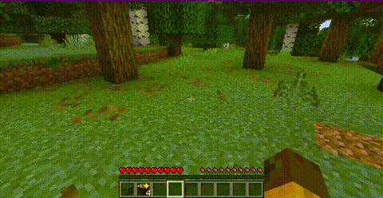

# ✦ PickupHighlight

**Never lose track of newly picked-up items again.** Every new item in your hotbar or inventory gets an animated golden star — plus a count badge showing how many you picked up.



## Features

- ⭐ **Animated star** pulses on every newly picked-up item
- 🔢 **Count badge** shows exactly how many items you picked up (`+1`, `+5`, …)
- 🎯 Works in **hotbar** and **inventory**
- 🔄 Highlights **auto-clear** on hover, inventory close, or hotbar selection
- ⏱️ **Optional timeout** — auto-clear after X seconds
- 🎨 **Configurable color** — gold by default, any hex color works
- ⚙️ **Full config GUI** when used with Cloth Config + Mod Menu

## Configuration

Config file: `.minecraft/config/pickuphighlight.json`

| Option | Default | Description |
|--------|---------|-------------|
| `clearOnHover` | `true` | Remove highlight when hovering over the item |
| `clearOnClose` | `true` | Remove all highlights when closing inventory |
| `clearOnSelect` | `true` | Remove highlight when selecting on hotbar |
| `highlightColor` | `0xFFD700` | Star color (gold by default) |
| `timeoutSeconds` | `0` | Auto-clear after X seconds (`0` = never) |
| `showCount` | `true` | Show count badge next to the star |

If [Cloth Config](https://modrinth.com/mod/cloth-config) and [Mod Menu](https://modrinth.com/mod/modmenu) are installed, you can configure the mod in-game from the Mods screen — no manual file editing needed.

## Requirements

- **Minecraft:** 26.1.x (1.21.x)
- **Fabric Loader:** ≥ 0.18.5
- **Fabric API:** Required

### Optional Dependencies

| Mod | Purpose |
|-----|---------|
| [Cloth Config](https://modrinth.com/mod/cloth-config) | In-game config screen |
| [Mod Menu](https://modrinth.com/mod/modmenu) | Access config from the Mods list |

## Installation

1. Install [Fabric Loader](https://fabricmc.net/) and [Fabric API](https://modrinth.com/mod/fabric-api)
2. Download PickupHighlight from [Modrinth](https://modrinth.com/mod/pickuphighlight) or [CurseForge](https://www.curseforge.com/minecraft/mc-mods/pickuphighlight)
3. Place the `.jar` file in your `mods` folder
4. (Optional) Install Cloth Config and Mod Menu for the in-game config screen

## License

```bash
./gradlew build
```

Built JAR will be in `build/libs/`.

## License

MIT — see [LICENSE](LICENSE)
